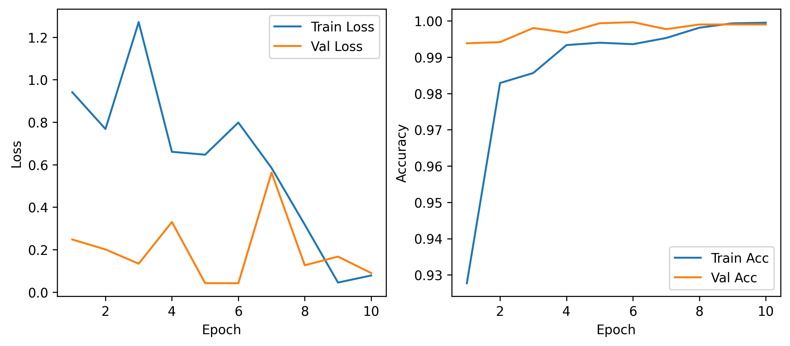
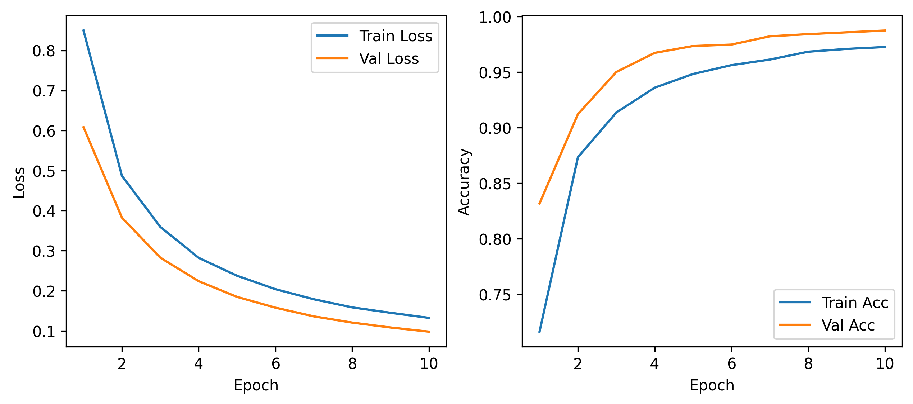
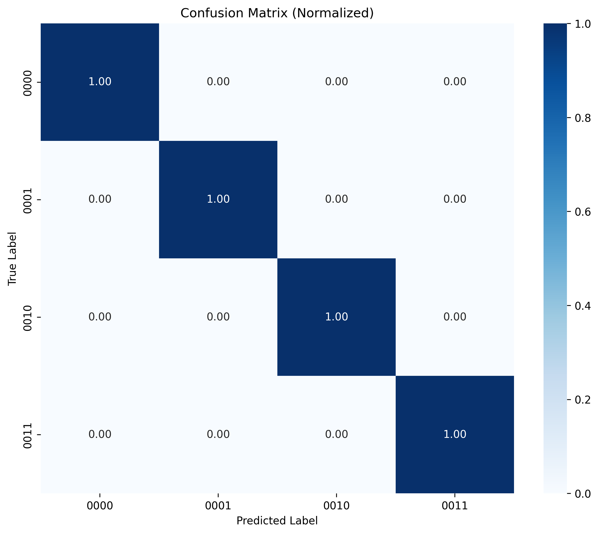

# LFBA_Thailand

This repository is dedicated to research conducted at Chulalongkorn University in Thailand, where we implement and evaluate LFBA (Logic-Free Building Automation) in practice.  
Unlike conventional building automation systems, LFBA directly outputs control signals from the model without predefined logic.  
For this study, we developed a system that operates two fans (air conditioning units) based on predefined scenarios.

## Objective of This Study

This research aims to achieve the following two objectives:

1. **Investigating the Presence of Shortcut Learning When Control Targets Appear in the Image**  
   In the LFBA experiments conducted at the University of Tokyo, shortcut learning was observed due to variations in lighting patterns, shadows, and contrast, which were unintentionally learned as distinguishing features.  
   In this study, we aim to determine whether similar shortcut learning occurs when the presence or absence of fan operation is visible in the images.  
   Therefore, it is crucial that the fans are captured in the images used for training.

2. **Evaluating Lightweight DNN Models for Learning**  
   While models such as VGG, ResNet, and ViT have been used in our previous studies, their fast convergence suggests that they may be over-specified for this task.  
   Since LFBA is intended for household applications, it is preferable for the system to run on small, low-power computing devices.  
   To explore this possibility, we evaluate existing lightweight models and compare their performance with VGG and other models to determine if they can achieve comparable accuracy.

## Experiment Scenarios

The experiment is conducted based on the following scenarios:

| ID  | Scenario | Label |
|---- | -------- | ------ |
| S00 | No one is present. | 0000 |
| S10 | A person is seated on the right, but their wrist is not visible. | 0000 |
| S11 | A person is seated on the right, and their wrist is visible. | 0010 |
| S20 | A person is seated on the left, but their wrist is not visible. | 0000 |
| S21 | A person is seated on the left, and their wrist is visible. | 0001 |
| S30 | Two people are seated, but neither of their wrists are visible. | 0000 |
| S32 | Two people are seated, but only the right person’s wrist is visible. | 0010 |
| S33 | Two people are seated, but only the left person’s wrist is visible. | 0001 |
| S34 | Two people are seated, and both of their wrists are visible. | 0011 |

## Results

We trained and evaluated models using datasets with VGG and MobileNetV3.  
Both models achieved an accuracy of over 95%, demonstrating their practical feasibility.  

Furthermore, heatmap visualizations of the VGG model confirmed that the model correctly focused on the wrist regions as intended, validating our scenario design.

